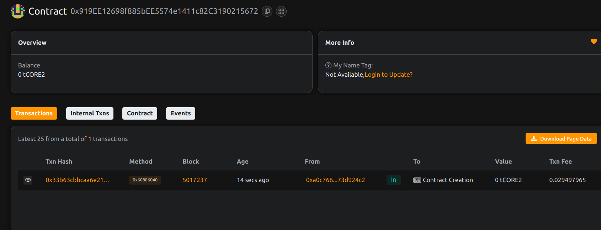

# Project Title: Reputrust: Credit-Free Peer Lending via On-Chain Identity
project done by Kumar Sahil 
## Project Description

Reputrust enables peer-to-peer lending without collateral by leveraging on-chain identity and behavioral reputation scores. It allows users with verified positive histories to access credit lines from the protocol’s liquidity pool.

## Project Vision

To empower underserved users and regions with decentralized credit by removing reliance on centralized credit checks and collateral-heavy systems.

## Key Features

- Loan requests based on trust, not collateral
- Dynamic reputation tracking and incentive mechanism
- Public loan registry for transparency
- Lenders deposit funds into a shared liquidity pool

## Future Scope

- Integration with decentralized identity (DID) frameworks
- DAO-based reputation scoring systems
- Micro-loans and merchant lending ecosystems
- Interest-bearing lending and multi-currency support

## Contract Details
0x919EE12698f885bEE5574e1411c82C3190215672

